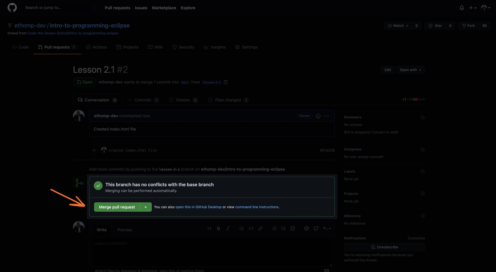
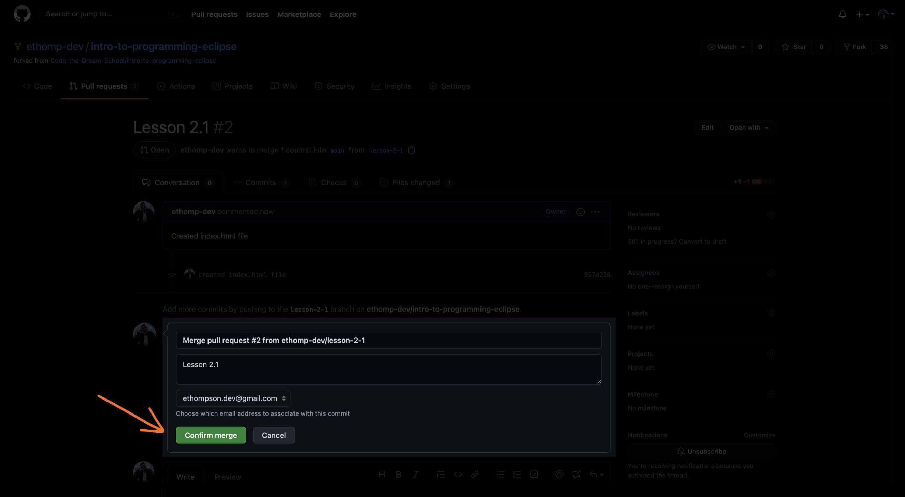

[< Back to Overview](../../README.md)

# How to: Merge a Pull Request

## Step 1: Navigate to your Pull Request and click "Merge"

## Step 2: Review the commit details and click "Confirm"

## Step 3: Congrats! 🎉

Additionally, you can **delete the branch** after you merge your Pull Request if you don't need the branch anymore.

---

Created by [Code the Dream](https://www.codethedream.org)
