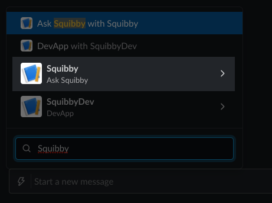
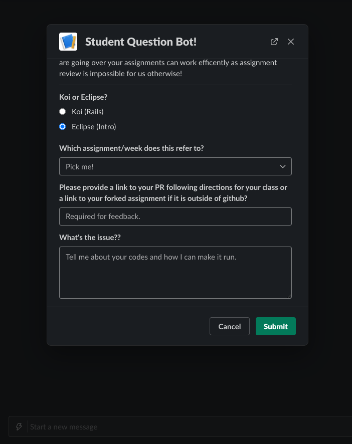

[< Back to Overview](../../README.md)

# How to: Submit an Assignment

## Step 1: Locate the "Shortcuts" icon in Slack

## Step 2: Select "Squibby" from the menu and click "Ask Squibby"

## Step 3: Complete the form and paste the URL you copied in the previous tutorial

## Step 4: Click "Submit" and you're done!

---

Created by [Code the Dream](https://www.codethedream.org)
