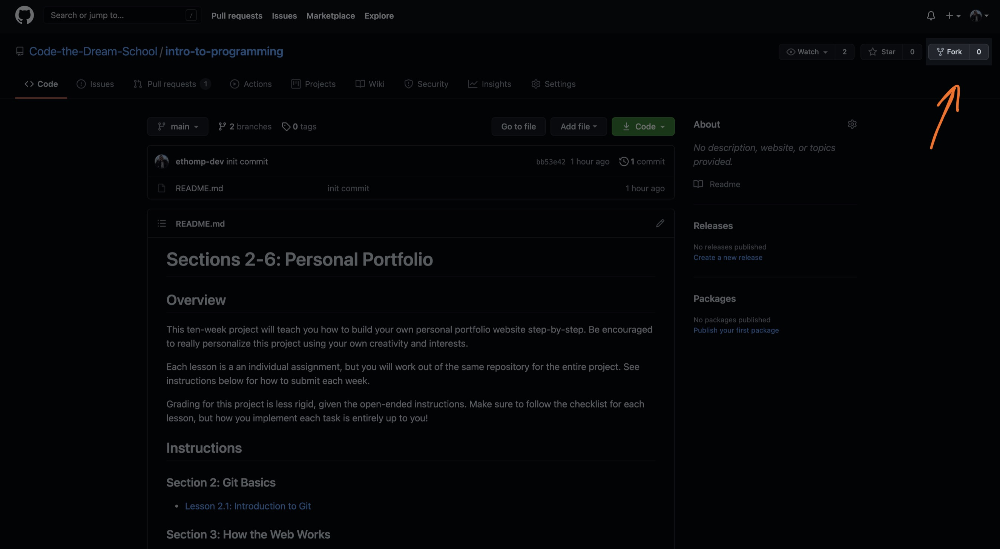
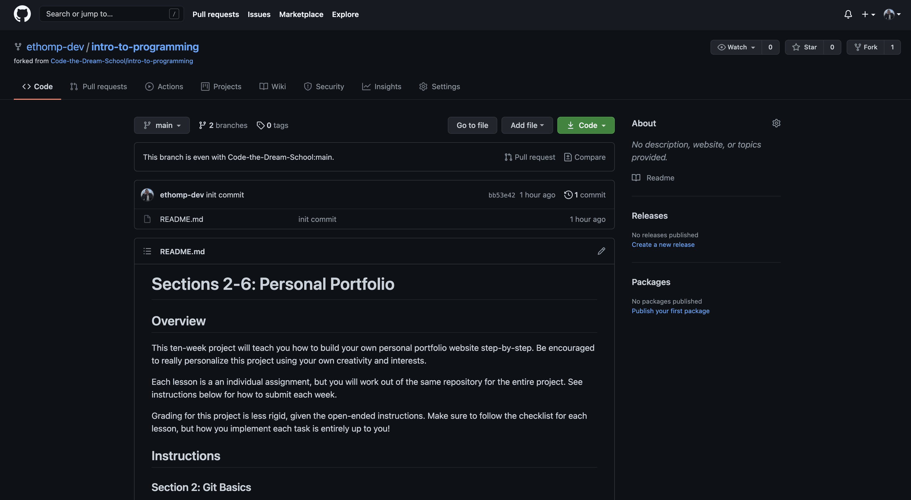

[< Back to Overview](../../README.md)

# Lesson 2.1: Introduction to Git

This assignment will teach you the following:

- Repositories
- Commits
- History
- GitHub

---

## Instructions

### Getting Started:

Fork this GitHub repository to create your own working version:

Select your GitHub account from the list:

You should be directed to your forked GitHub repository:

Click the "Code" button and copy the URL for your repository:

Clone this repository so that the code is available on your local machine:

> Hint: Run this command from the directory where you want to store your code

> Note: Replace `<url>` with the URL you copied in the previous step

    git clone <url>

Navigate to the directory you just cloned in your terminal:

    cd intro-to-programming

Create a new local branch to work on separate from the `main` branch:

    git checkout -b lesson-2-1

Now, open the project directory in your code editor and continue to the next section.

### Task List:

- [ ] Create a file called `index.html`
- [ ] Type your name into the file and save

### Final Step:

Check the status of your local repository to double-check the changes you made:

    git status

Stage the file(s) that you edited:

    git add .

Check the status again and notice that the changes from before are now staged:

    git status

Create a commit for the changes you made and add a message describing the changes you made:

> Note: Replace `<message>` with your message (example - "created index.html file")

    git commit -m "<message>"

Push your commit to the remote repository (visible in GitHub):

    git push

Check the log to make sure your commit has been published:

    git log --oneline

Create a pull request and submit:

[View instructions](../common/how-to-pull-request.md)

---

Created by [Code the Dream](https://www.codethedream.org)
