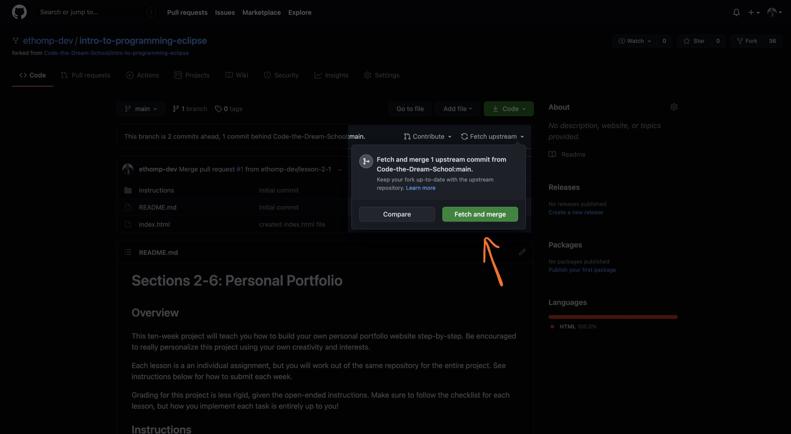

[< Back to Overview](../../README.md)

# Lesson 4.1: HTML Basics

This assignment will teach you the following:

- Semantic markup
- Formatting page content
- Understanding file paths
- Displaying images
- Inline vs. block level elements

---

## Instructions

### Getting Started:

Merge your pull request from the previous lesson (if you haven't already):

[View tutorial](../common/how-to-merge.md)

Fetch the updated instructions from the base repository:

> Note: you may receive a conflict if you've made changes to the README or other instructions

Checkout your main branch and pull changes:

    git checkout main
    git pull

Create a new local branch to work on separate from the `main` branch:

    git checkout -b lesson-4-1

Now, open the project directory in your code editor and continue to the next section.

### Task List:

When building websites, it is common to use "boilerplate" HTML code as a starting point that includes all the required elements and meta tags.

However, in this lesson, you will be writing all the required markup from scratch to better understand what each tag is for.

_Authors' Note:_

The instructions below reference "tags" and "elements". In HTML, an element consists of a "start tag", some content, and an "end tag".

So when describing the `<title>` element, for example, we're referring to this: `<title>Your Title</title>`.

Also, some HTML elements are "self-closing", meaning that they have one tag that opens and closes at the same time (e.g. `<meta name="description" content="Your description" />`).

#### **Document**

For this assignment, you will be working exclusively within the `index.html` file.

- [ ] Open your `index.html` file
- [ ] Define the document type at the top of the file (e.g. `<!DOCTYPE html>`)
- [ ] Below that, wrap the existing text in an `<html>` element

#### **Head Element**

The "head" of an HTML document contains all the page's meta information, such as title and description.

- [ ] In between the opening and closing `<html>` tags, insert a `<head>` element
- [ ] Inside the `<head>` element, add a `<title>` element for the title of your webpage
- [ ] Below that, add additional `<meta>` elements ([learn more](https://www.w3schools.com/html/html_head.asp))

#### **Body Element**

The "body" of an HTML document contains all the page's visible content.

- [ ] After the closing `</head>` tag, insert a `<body>` element
- [ ] In between the opening and closing `<body>` tags, paste all of your text from the previous lesson

#### **Semantic Markup**

HTML describes the structure of a webpage using various semantic elements, such as: headings, paragraphs, lists, and more.

- [ ] Separate the "About", "Experience", and "Connect" sections using the `<section>` element
- [ ] Wrap each heading in a heading element (e.g. `<h1>About</h1>`)
- [ ] Wrap each paragraph in a paragraph tag (e.g. `
Something about me...
`)
- [ ] Wrap each list in an unordered list element ([learn more](https://www.w3schools.com/html/html_lists.asp))

Feel free to use even more HTML elements by adding images, navigation menus, etc.

### Final Step:

Check the status of your local repository to double-check the changes you made:

    git status

Stage the file(s) that you edited:

    git add .

Check the status again and notice that the changes from before are now staged:

    git status

Create a commit for the changes you made and add a message describing the changes you made:

> Note: Replace `<message>` with your message (example - "added html elements in index.html file")

    git commit -m "<message>"

Push your commit to the remote repository (visible in GitHub):

    git push

Check the log to make sure your commit has been published:

    git log --oneline

Create a pull request and submit:

[View instructions](../common/how-to-pull-request.md)

---

Created by [Code the Dream](https://www.codethedream.org)
