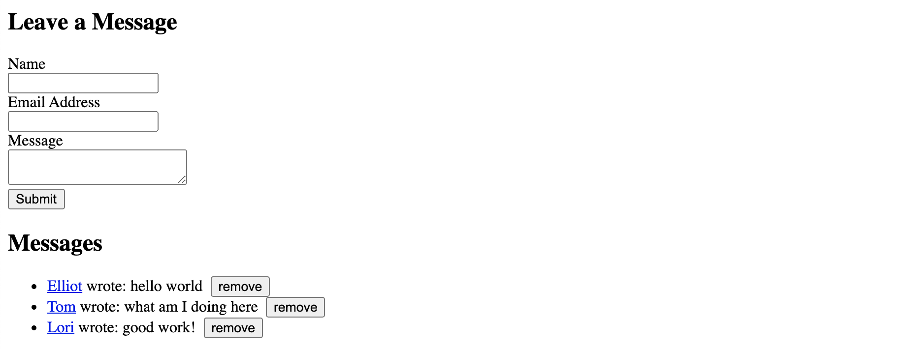

[< Back to Overview](../../README.md)

# Lesson 4.3: HTML Forms and DOM Practice

This assignment will teach you the following:

- HTML Forms
- DOM element selection
- DOM traversal
- DOM manipulation
- Event handling

---

## Instructions

### Getting Started:

Merge your pull request from the previous lesson (if you haven't already):

[View tutorial](../common/how-to-merge.md)

Fetch the updated instructions from the base repository:

> Note: you may receive a conflict if you've made changes to the README or other instructions

Checkout your main branch and pull changes:

    git checkout main
    git pull

Create a new local branch to work on separate from the `main` branch:

    git checkout -b lesson-4-3

Now, open the project directory in your code editor and continue to the next section.

### Task List:

#### Create Message Form

- [ ] Open your `index.html` file
- [ ] Above the `<footer>` element, add an empty `<section>` element
- [ ] Inside the new `<section>` element, create a level-two heading that says "Leave a Message"
- [ ] After the heading, create an HTML `<form>` element with a `name` attribute that equals "leave_message"
- [ ] Inside the `<form>` element, add the following:
  1. `<input>` element with attributes: `type` "text", `name` "name", and `required` true
  2. `<input>` element with attributes: `type` "email", `name` "email", and `required` true
  3. `<textarea>` element with attributes: `name` "message" and `required` true
  4. `<button>` element that says "Submit" and has `type` attribute equal to "submit"
  5. Each form field should also have a corresponding `<label>` element
  6. (Optional) Use ` ` elements to stack the form fields
- [ ] Save and refresh your browser

#### Add Message List Section

- [ ] After the `<section>` element from the previous step, create a new `<section>` element with an `id` of "messages"
- [ ] Inside that element, create a level-two heading that says "Messages"
- [ ] After the heading, add an empty unordered list (`<ul>`) element
- [ ] Save and refresh your browser

#### Handle Message Form Submit

- [ ] Open your `index.js` file and start at the bottom
- [ ] Using "DOM Selection", select the "leave_message" form by `name` attribute and store it in a variable named `messageForm`
- [ ] Add an event listener to the `messageForm` element that handles the "submit" event
  - hint: `addEventListener` method
- [ ] Inside the callback function for your event listener, create a new variable for each of the three form fields and retrieve the value from the event
  - hint: `event.target` is the form, `event.target.name` is the first input element
- [ ] Inside the callback function for your event listener, add a `console.log` statement to log the three variables you created in the previous step
- [ ] Save and refresh your browser
- [ ] Fill out the HTML form in your browser and hit "Submit"

> Note: at this point, you should notice that the browser is refreshing automatically when you submit your form which is not the desired behavior

- [ ] Inside the callback function, above the other code you just wrote, add a new line to prevent the default refreshing behavior of the "submit" event
  - hint: `preventDefault` method
- [ ] Save and refresh your browser
- [ ] Fill out the HTML form in your browser and hit "Submit"
  - You should see that the page **does not** refresh and your values are logged in the console

> Note: at this point, you should notice that the form is submitting properly but the form fields are not reset after submit

- [ ] Inside the callback function, on the very last line, add a new line of code to clear the form
  - hint: `reset` method
- [ ] Save and refresh your browser

#### Display Messages in List

- [ ] Open `index.js` and start inside the event listener callback function on the line **above** where you reset the form
- [ ] Using "DOM Selection", select the #messages section by `id` and store it in a variable named `messageSection`
- [ ] Using "DOM Selection", query the `messageSection` (instead of the entire `document`) to find the `<ul>` element and store it in a variable named `messageList`
- [ ] Create a new list item (`li`) element and store it in a variable named `newMessage`
- [ ] On the next line, set the inner HTML of your `newMessage` element with the following information:
  - `<a>` element that displays the "name" and links to the "email" (hint: use the `mailto:` prefix)
  - `` element that displays the "message"
- [ ] Create a new `<button>` element and store it in a variable named `removeButton`
  - Set the inner text to "remove"
  - Set the `type` attribute to "button"
  - Add an event listener to the `removeButton` element that handles the "click" event
    - Inside the callback function, find the button's parent element using DOM Traversal (hint: `parentNode` property) and store it in a variable named `entry`
    - Remove the `entry` element from the DOM (hint: `remove` method)
- [ ] Append the `removeButton` to the `newMessage` element
  - hint: `appendChild` method
- [ ] Append the `newMessage` to the `messageList` element
- [ ] Save and refresh your browser

#### Final Result

#### Stretch Goals

These tasks are **entirely optional**, but if you'd like a challenge then do your best to complete each item.

- [ ] (Optional) Hide the #messages section when the list is empty
- [ ] (Optional) Create an "edit" button for each message entry that allows the user to input a new/modified message

### Final Step:

Check the status of your local repository to double-check the changes you made:

    git status

Stage the file(s) that you edited:

    git add .

Check the status again and notice that the changes from before are now staged:

    git status

Create a commit for the changes you made and add a message describing the changes you made:

> Note: Replace `<message>` with your message

    git commit -m "<message>"

Push your commit to the remote repository (visible in GitHub):

    git push

Check the log to make sure your commit has been published:

    git log --oneline

Create a pull request and submit:

[View instructions](../common/how-to-pull-request.md)

---

Created by [Code the Dream](https://www.codethedream.org)
